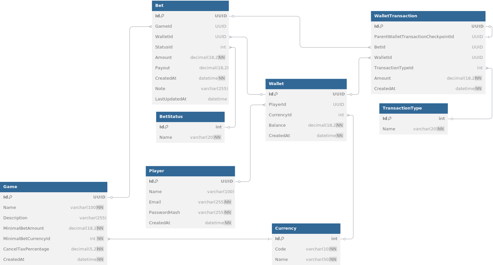

# TGLabChallenge API

## 📖 About the Project

The TGLabChallenge API is an application developed in .NET 6 that implements functionalities for managing players, bets, and wallets. The application uses Entity Framework Core for data persistence and SignalR for real-time notifications.

## 📊 Entity-Relationship Model

The diagram below represents the entity-relationship model (ERM) of the application:



## 🚀 How to Run

### Prerequisites

- [.NET 6 SDK](https://dotnet.microsoft.com/download/dotnet/6.0)
- [Docker](https://www.docker.com/)
- [Visual Studio](https://visualstudio.microsoft.com/) (optional)

### Database Configuration

Make sure to configure the environment variables in the `.env` file for the PostgreSQL database. For local development, the SQLite database will be used automatically.

### Database Migration

Before starting the application, you need to run the migrations to ensure the database is up to date.

You can do this by first **setting the required environment variables** in the `.env` file and then running the following command:

```bash
dotnet ef database update --project Infrastructure
```

Or, if using Docker, run the migration service:

```bash
docker compose run --rm migrations
```

## 🛠️ Execution Modes

### Development

Run the application locally with the following command:

```bash
dotnet run --project API
```

### Production

Use Docker Compose to run the application in production:

```bash
docker compose up -d
```

### Tests

Run automated tests with the following command:

```bash
dotnet test
```

### Visual Studio

1. Open the solution in Visual Studio.
2. Right-click on the `API` project and select **Set as Startup Project**.
3. Press **CTRL + F5** to start the application.

#### Running Tests in Visual Studio

1. In the menu, go to **Test > Run All Tests** or press **Ctrl + R, A**.
2. View the results in the **Test Explorer** window.

## 📦 Project Structure

- **API**: Contains the controllers and application configurations.
- **Application**: Contains the services and business models.
- **Domain**: Defines the domain entities and enums.
- **Infrastructure**: Implements data persistence and database configurations.
- **Tests**: Contains unit and integration tests.

### WebDashboard

The `WebDashboard` is a React application that serves as a dashboard for testing the API endpoints. It allows users to input a JWT token and interact with authentication, player, and bet endpoints.

#### Prerequisites

- [Node.js 20.x](https://nodejs.org/)
- [npm](https://www.npmjs.com/)

#### How to Run

1. Navigate to the `WebDashboard` directory:
   ```bash
   cd WebDashboard
   ```

2. Install dependencies:
   ```bash
   npm install
   ```

3. Start the development server:
   ```bash
   npm start
   ```

4. Access the dashboard in the browser at `http://localhost:3000`.

#### Docker

The WebDashboard is already included in the Docker Compose configuration. When you run:

```bash
docker compose up -d
```

The WebDashboard will be automatically built and deployed, available at `http://localhost:3000`.

## 🛡️ Security

The application uses JWT authentication to protect the APIs. Make sure to configure the JWT keys and parameters in the `appsettings.json` file.

### HTTPS Certificate for Production

For production deployment testing, the `localhost.pfx` file is used as the HTTPS certificate. The path and password for the certificate are configured via environment variables in the `.env` file:

```env
CERTIFICATE_PATH=./localhost.pfx
CERTIFICATE_PASSWORD=123456Sete
```

Make sure to replace these variables with secure values before deploying to real production. Additionally, configure the certificate usage in the application pipeline in the `Program.cs` file.

Ensure the certificate and password are stored securely and appropriate environment variables are set for production.

## 📚 API Documentation

The API documentation can be accessed at `/swagger` when the application is running (in development mode).

The development flag is present in the `launchSettings.json` file and can be activated to enable Swagger:

```json
"profiles": {
  "API": {
    "environmentVariables": {
      "ASPNETCORE_ENVIRONMENT": "Development"
    }
  }
}
```

## 🐳 Docker Compose

The `docker-compose.yml` file configures the services required for production execution, including:

- **API**: Main application service.
- **Migrations**: Service for applying database migrations.
- **PostgreSQL**: Relational database.
- **WebDashboard**: React application for testing API endpoints.

To start all services with Docker Compose:

```bash
docker compose up -d
```

After starting the services:
- The API will be available at `http://localhost:8080`
- The WebDashboard will be available at `http://localhost:3000`

### Environment Configuration

The application uses environment variables defined in the `.env` file:

```env
# Database settings
POSTGRES_USER=prod-user
POSTGRES_PASSWORD=prod-password
POSTGRES_DB=prod-db
POSTGRES_HOST=postgres-db
POSTGRES_PORT=5432

# API settings
ASPNETCORE_ENVIRONMENT=Production
ASPNETCORE_HTTPS_PORTS=8081
ASPNETCORE_HTTP_PORTS=8080

# Certificate settings
CERTIFICATE_PATH=./localhost.pfx
CERTIFICATE_PASSWORD=123456Sete
```

Make sure to modify these values for your production environment.

## 📝 License

This project is licensed under the MIT License. See the `LICENSE` file for more details.
