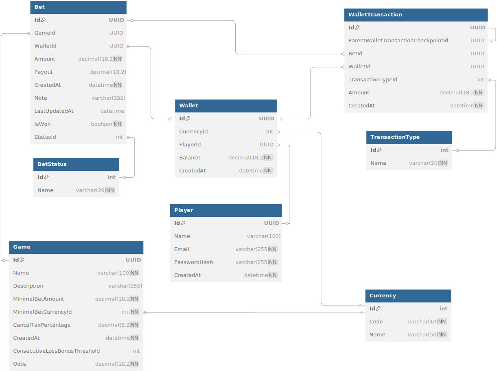

# TGLabChallenge API

## 📖 Sobre o Projeto

O TGLabChallenge API é uma aplicação desenvolvida em .NET 6 que implementa funcionalidades de gerenciamento de jogadores, apostas e carteiras. A aplicação utiliza Entity Framework Core para persistência de dados e SignalR para notificações em tempo real.

## 📊 Modelo Entidade-Relacionamento

O diagrama abaixo representa o modelo entidade-relacionamento (MER) da aplicação:



## 🚀 Como executar

### Pré-requisitos

- [.NET 6 SDK](https://dotnet.microsoft.com/download/dotnet/6.0)
- [Docker](https://www.docker.com/)
- [Visual Studio](https://visualstudio.microsoft.com/) (opcional)

### Configuração do Banco de Dados

Certifique-se de configurar as variáveis de ambiente no arquivo `.env` para o banco de dados PostgreSQL. Para desenvolvimento local, o banco de dados SQLite será utilizado automaticamente.

### Migração do Banco de Dados

Antes de iniciar a aplicação, execute as migrações para garantir que o banco de dados esteja atualizado:

```bash
dotnet ef database update --project Infrastructure
```

## 🛠️ Modos de Execução

### Desenvolvimento

Execute a aplicação localmente com o seguinte comando:

```bash
dotnet run --project API
```

### Produção

Utilize Docker Compose para executar a aplicação em produção:

```bash
docker compose up -d
```

### Testes

Execute os testes automatizados com o seguinte comando:

```bash
dotnet test
```

### Visual Studio

1. Abra a solução no Visual Studio.
2. Clique com o botão direito no projeto `API` e selecione **Definir como projeto de inicialização**.
3. Pressione **CTRL + F5** para iniciar a aplicação.

#### Rodando Testes no Visual Studio

1. No menu, vá em **Testar > Executar Todos os Testes** ou pressione **Ctrl + R, A**.
2. Visualize os resultados na janela **Test Explorer**.

## 📦 Estrutura do Projeto

- **API**: Contém os controladores e configurações da aplicação.
- **Application**: Contém os serviços e modelos de negócio.
- **Domain**: Define as entidades e enums do domínio.
- **Infrastructure**: Implementa a persistência de dados e configurações do banco de dados.
- **Tests**: Contém os testes unitários e de integração.

## 🛡️ Segurança

A aplicação utiliza autenticação JWT para proteger as APIs. Certifique-se de configurar as chaves e parâmetros JWT no arquivo `appsettings.json`.

## 📚 Documentação da API

A documentação da API pode ser acessada em `/swagger` quando a aplicação estiver em execução (no modo de desenvolvimento).

## 🐳 Docker Compose

O arquivo `docker-compose.yml` configura os serviços necessários para execução em produção, incluindo:

- **API**: Serviço principal da aplicação.
- **Migrations**: Serviço para aplicar migrações no banco de dados.
- **PostgreSQL**: Banco de dados relacional.

## 📝 Licença

Este projeto está sob a licença MIT. Consulte o arquivo `LICENSE` para mais detalhes.
